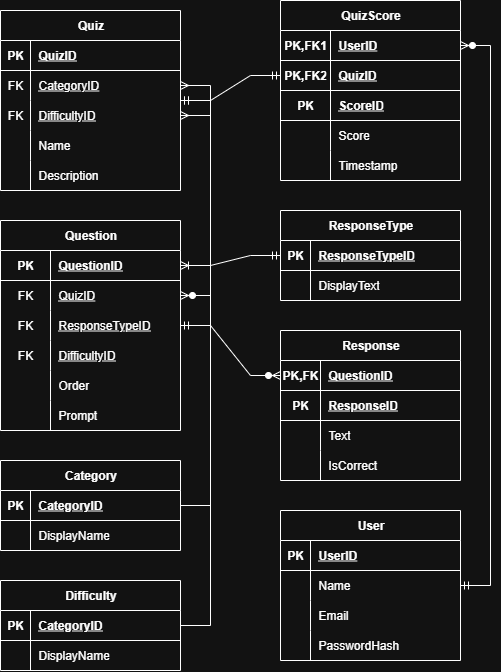

# SimpleQuizApp

A full-stack quiz application for playing, sharing, and receiving feedback on generated quizzes.

## Objective

Create a web app that allows the user to take a quiz on a topic of their choice.
The app should fetch questions and answers from an external API, such as 
<a href="https://opentdb.com/">Open Trivia Database</a>. The app should also
keep track of the user's score and display feedback at the end of the quiz.

## Getting Started

### Prerequisites
- Java 17 or higher
- Maven 3.8+

### Running the Application
1. Clone the repository
2. Navigate to the project directory
3. Run: `mvn spring-boot:run`
4. Open browser to `http://localhost:8080`

### Database
- Uses in-memory H2 database (no configuration needed)
- Auto-populated with Open Trivia Database categories and difficulties on first startup

# Design

## Approach

I decided to implement this application using Spring Boot, a Java framework intended for building production-grade web applications and microservices. The application will be accessible on a web-based frontend. Persistent information will be stored in an in-memory H2 relational database.

## Features

I allotted myself an evening (approximately 6 hours) to work on designing and developing this program. Below is a list of functionalities a fully-developed application with this goal should have. A box is checked if the feature was implemented in the allotted time.
- [x] Retrieve data from the Open Trivia Database
- [x] Represent quizzes in a relational database for expandability
- [x] Present completable quizzes on a web frontend
- [x] Grade quizzes on the backend and return responses
- [x] Enable generation of playable quizzes by users with parameter selection
- [ ] Scoring based on time and anti-cheat on the backend
- [ ] Login and register users with secure password management
- [ ] Display public leaderboards for high scores
- [ ] Create customizable questions separate from Open Trivia Database on the application

Long term, it would be beneficial to add these features:
- Implement additional support for quiz generation from other APIs
- User authentication with Spring Security
- Quiz recommendations from a user's quiz history
- Searching for quizzes (by ID, name, category, difficulty, etc.)
- Submission and generalized rate limiting for API requests

## Entities

When designing the backend systems, scalability and modularity was made a top priority. To do so effectively, all persistent data is represented and stored in a relational database. For debugging and development, the data is stored in an in-memory database for minimal configuration, but this default system can be modified to run on any JDBC-compatible database through configuration. (See [here](https://docs.oracle.com/cd/E19226-01/820-7688/gawms/index.html) to for a list of compatible databases).

## REST API Usage

The structure of the request and response bodies are all serialized to and deserialized from JSON automatically with Jackson. To view the classes where the bodies are generated from, view the directory `src/main/java/net/cmr/quizapp/entity`. To view how classes are converted to and from JSON, reference [this article](https://blog.codeminer42.com/serialization-and-deserialization-in-java-using-jackson/).

| Method | Endpoint | Description | Request Body | Response |
|--------|----------|-------------|--------------|----------|
| POST | `/api/quiz/opentdb` | Generate a custom quiz from Open Trivia Database | `OTDBQuizResponse` | `Long` (Generated Quiz ID, -1 if unsuccessful) |
| GET | `/api/quiz/getRandom` | Retrieve a random quiz | None | `QuizResponseEntity` |
| GET | `/api/quiz/get/{quizId}` | Get a specific quiz by ID | None | `QuizResponseEntity` |
| POST | `/api/quiz/submit` | Submit a completed quiz for grading | `QuizSubmittion` | `QuizScoreResponse` |
| GET | `/api/categories` | Get all available quiz categories | None | `Map<Long, String>` <Category ID, Category String>|
| GET | `/api/difficulties` | Get all available difficulty levels | None | `Map<Long, String>` <Difficulty ID, Difficulty String>|
| GET | `/api/response-types` | Get all available response types | None | `Map<Long, String>` <Response Type ID, Response Type String>|

The default category strings are listed [here](https://opentdb.com/api_category.php) from the Open Trivia Database. They are automatically added to the database when it is loaded for the first time.

Default Response Type Strings:
- "Multiple Choice"
- "Multiple Select"
- "True False"

Default Difficulty Strings:
- "easy"
- "medium"
- "hard"

## What You Can Do Right Now

- **Browse and Take a Quiz**: Visit `/search.html` to select one of 9 random quizzes and answer all questions
- **Get Graded**: Submit your answers and see your score with correct/incorrect answer feedback
- **Generate a Quiz**: Visit `/create.html` to generate a quiz from Open Trivia Database and play it
- **Share a Quiz**: After generating a quiz, copy the generated URL for anyone to play

In it's current state, a user can enter the website and either view already existing quizzes or generate their own quizzes. In automatically generating a quiz, the user may select from any options available on the Open Trivia Database, as they are automatically requested and loaded onto the backend's database on initialization.

Each quiz can consist of an unlimited amount of questions in the backend (restricted to 50 for Open Trivia Database autogeneration), and there are 3 supported question types: multiple choice, multiple select, and true/false questions. Given the existing framework, other response types, including short answer, fill-in-the-blank, and matching questions could be implemented easily.

After a user answers all of the questions, they can submit their answers to receive a score and feedback on what questions they got wrong. Although not implemented in the current version, the score would ideally be sent to a public leaderboard to display who has the top score, assuming the user is logged in.

## Challenges Encountered
- **Rate Limiting**: It was initially planned to generate Open Trivia Database quizzes on the backend, but doing so would result in rate limits.
    - **Solution**: Implemented a hybrid approach where clients fetch directly from the Open Trivia Database, and then POST to `/api/quiz/opentdb` for server-side validation and persistence.
- **Extendable Question Types Without Redeployment**: The type of response for a question (multiple choice, true or false, etc.) needed to be a controlled set of values, but using Java's enums would require recompilation when a new question type is added.
    - **Solution**: Modeled response types as database entities in a `ResponseType` table, where all available types being exposed via `/api/response-types`, allowing additions without server restarts.
- **Quiz Display Without Revealing Answers**: Questions needed to be sent to the frontend without revealing answers until after submission.
    - **Solution**: Send the quiz to the client through a prepared `QuizResponseEntity` DTO, where answers are conditionally included upon construction with a `QuizResponseEntity.from()` factory method.